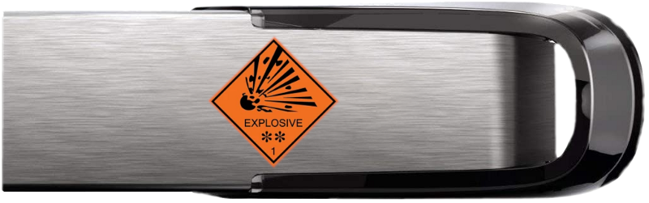

# usb-drive
The one and only, exploding USB drive. 

Ovrdrive is a purpose build security focused usb drive. If the user doesn't lick their fingers while inserting the drive it will appear completely blank. It uses a SM3257EN and AVR ATTINY and is currently a work in progress. It is entirely open source and all the tools used to build it are open source.
